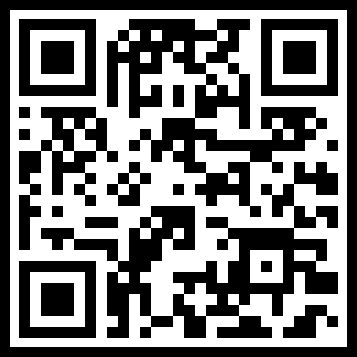

## 이스트소프트 프로젝트 5팀
  

### 프로젝트 5팀 구성
| 이름  | 역할 | 담당 업무         |
| ------ | ----- | ------------------ |
| 이병현  | 팀장 | 기본 세팅, 메인페이지 작업, Shop 페이지 작업, github 형상관리, 서브페이지 서포팅, 결과보고서 작성, 프로젝트 발표 |
| 김석용  | 팀원 | 에피소드 페이지 작업, 팟캐스트 뷰페이지 작업 |
| 전윤교  | 팀원 | 호스트안내 페이지 작업, 팟캐스트 뷰페이지 작업 |
| 송승엽  | 팀원 | 팟캐스트방송목록 페이지 작업, 팟캐스트 뷰페이지 작업 |

  

### 🛠️사용한 기술 스택
- Basic: `HTML`, `CSS`, `JavaScript`
<!-- - Library:  `Swiper` -->
  

### 📅회의록/중간보고
- 회의록 : https://www.notion.so/5-15e021880f7a808aa59dd5dcb44b7caa
- 중간보고 : https://www.notion.so/5-15f021880f7a80eab2c9fa370184ecd6
  

웹서비스 바로가기 

